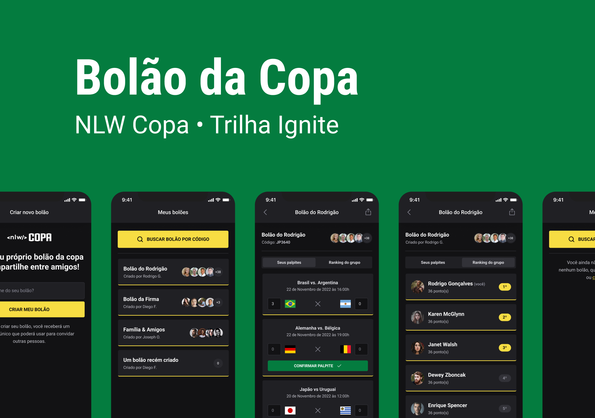
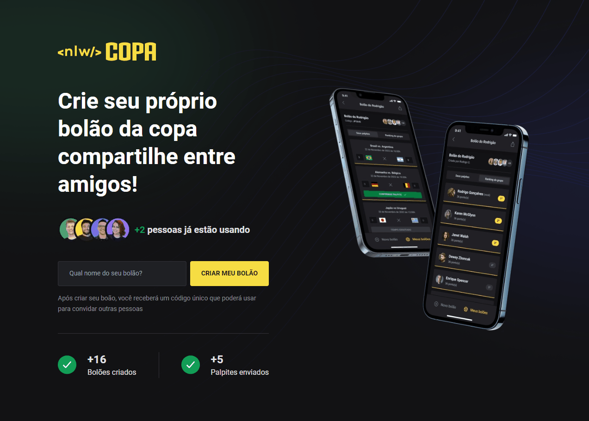

<section align="center">
    
</section>

<h2 align="center">Summary</h2>

<p align="center">
    <a href="#about">📙 About</a>
    <a href="#preview">🖼️ Preview</a>
    <a href="#start">📖 How to Start</a>
    <a href="#features">💡 Features</a>
    <a href="#technologies">💻 Technologies</a>
</p>

<h4 align="center">
   ✔️ Bolão da Copa finished ✔️
</h4>

<h2 id="about">📙 About</H2>

<p><strong>Bolão da Copa</strong> from Next Level Week is designed for those who loves soccer and want to use a platform that allows the participant to create your own guesses about the World Cup 2022 games results. This application is usable on smartphone devices and has a single page layout available on browsers to display introductory information about this tool.
<p>Talking about the features, this app has full backend-mobile-web integration, jwt with google authentication system, routing functionality, organized code architecture and more</p>
<p>The <strong>Next Level Week</strong> is a whole week coding event based on the development of a complete application using some of the most used tools available on the JavaScript Stack, such as Tailwind, React, NodeJS and React Native. The purpose is all about keep learning, sharing the challenges with other students, making networking and improving your hard and soft skills.</p>

<!-- <p>This project used <a href="https://vercel.com/">Vercel</a> and <a href="https://heroku.com">Heroku</a> for deployment.</p> -->

<p>Originally created on Next Level Week from <a href="https://www.rocketseat.com.br/">Rocketseat</a> and made by <a href="https://www.linkedin.com/in/kleverson-kenji-iwatani/">Kenji Iwatani</a></p>

<!-- <h3><a href="https://feedget-kenji.vercel.app/">Check website &rarr;</a></h3> -->

---

<H2 id="preview">🖼️ Preview</H2>

<h4>Web overview:</h4>

<section align="center">
    
</section>

<h4>Mobile overview:</h4>

<section align="center">
    
</section>

---

<H2 id="start">📖 How to Start</H2>

<h4>Starting this repository</h3>

```bash
# Clone this repository
$ git clone https://github.com/iwataniKenji/bolao-da-copa

# Access the project directory
$ cd bolao-da-copa
```

<h4>Server</h4>

```bash
# Access the "server" folder
$ cd server

# Install dependencies
$ npm install

# Rename '.env.example' to '.env' and set your env variable
$ ren ".env.example" ".env"

# With a PostgreSQL running, run the migrations
$ npx prisma migrate dev

# Start the server
$ npm run dev
```

<h4>Web</h4>

```bash
# Access the "web" folder
$ cd web

# Install dependencies
$ npm install

# Start the application
$ npm run dev
```

<h4>Mobile</h4>

```bash
# Access the 'mobile' folder
$ cd mobile

# Install dependencies
$ npm install

# Start bundle
$ npm expo start

# Download expo app on your phone and scan the QR Code
```

---

<H2 id="features">💡 Features</H2>

- [x] Google account based authentication system
- [x] Jwt token authentication
- [x] Context usage and data persistence
- [x] Routing feature on mobile version
- [x] Full integration between backend and web/mobile
- [x] Declarative interface with Tailwind on web application
- [x] Share poll code feature

---

<H2 id="technologies">💻 Technologies</H2>

<h4>Frontend</h4>

- [x] <a href="https://nextjs.org/">NextJS</a>
- [x] <a href="https://www.typescriptlang.org/">Typescript</a>
- [x] <a href="https://tailwindcss.com/">Tailwindcss</a>
- [x] <a href="https://github.com/colinhacks/zod">Zod</a>
- [x] <a href="https://axios-http.com/">Axios</a>

<h4>Mobile</h4>

- [x] <a href="https://reactnative.dev/">React Native</a>
- [x] <a href="https://expo.dev/">Expo</a>
- [x] <a href="https://nativebase.io/">Native Base</a>
- [x] <a href="https://phosphoricons.com/">Phosphor Icons</a>

<h4>Backend and Deployment</h4>

- [x] <a href="https://nodejs.org/en/">NodeJS</a>
- [x] <a href="https://www.fastify.io/">Fastify</a>
- [x] <a href="https://www.prisma.io/">Prisma</a>
- [x] <a href="https://insomnia.rest/">Insomnia</a>
- [x] <a href="https://jwt.io/">Jwt</a>
